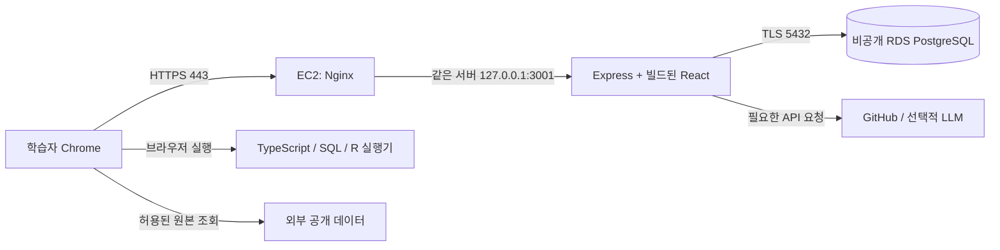

# Vibe Lab AWS 평가 배포 안내

> **2026-09-15 우선순위 변경:** 사용자가 추가 비용 없는 진행을 요청했습니다. 현재 실행 경로는 `docs/FREE_DEMO.md`의 로컬 PostgreSQL + 무료 임시 공개입니다. 아래 AWS 구성은 향후 전환용 참고이며, 현재 AWS 생성·구매 계획이 아닙니다.

작성일: 2026-09-15 · 코드 확인 기준: `a91cbff` / `feature/mvp-savepoint-20260912`

이 문서는 배포 구성과 실행·검증 절차입니다. 작업 상태는 `PROGRESS.md`, 우선순위와 담당 작업은 `ROADMAP.md`에서 관리합니다. AWS 리소스 생성, 배포 설정 적용, 원격 Push는 이번 문서 작성에 포함되지 않았습니다.

## 1. 목표와 배포 범위

다양한 이공계 전공의 대학생·엔지니어가 자기 분야의 데이터를 처리하고, 코드 빈칸을 채워 실행·테스트하며 원리를 배우는 MVP를 평가 환경에 배포합니다. 기존 목표일은 2026-09-15이며, 정확한 평가 시간과 클라우드 운영 기간은 사용자 확인이 필요합니다.

첫 배포는 소규모 평가자를 대상으로 합니다. 용량 검증의 시작점은 동시 사용자 5~10명으로 제안하며, 현재 처리 성능을 측정한 수치는 아닙니다. 새로운 기능보다 로그인 → 프로필 → 과제 선택 → 코드 실행 → 진도 저장의 안정성을 우선합니다.

현재 LLM 실제 연결은 완료로 간주하지 않습니다. 규칙 기반 피드백으로 시연할 수 있으며, 실제 AI 튜터를 평가 필수 기능으로 삼는다면 공급자·모델 확인과 별도의 실제 호출 검증이 필요합니다. 선결제 키를 LG Display 전용 API로 가정하지 않습니다.

## 2. 권장 구성



| 항목 | 초기 제안 | 이유 / 제한 |
|---|---|---|
| 리전 | 서울, 계정 정책 확인 후 확정 | 사용자 위치와 기존 계획 반영 |
| EC2 | Linux x86_64, 메모리 2 GiB급 소형 인스턴스 1대부터 검토 | Node 24와 Nginx 운영. 정확한 종류는 예산·부하로 확정 |
| RDS | PostgreSQL 17, 소형 Single-AZ, 최소 필요 저장 공간 | 로컬·CI 주 버전에 맞춤. 자동 다중 AZ 장애 전환은 없음 |
| 네트워크 | 퍼블릭 서브넷 EC2, 프라이빗 서브넷 RDS | RDS 공개 접근 비활성화. DB 서브넷 그룹은 최소 2개 AZ에 구성 |
| HTTPS | 보유 도메인 또는 서브도메인 + Nginx TLS 종료 | 인증서 갱신과 HTTP→HTTPS 이동 검증 |
| 프로세스 | systemd로 Express 자동 시작·재시작 | 터미널 종료나 서버 재부팅 후에도 실행 |
| 데이터 | 원자료 외부 조회, 계정·진도·세션은 RDS | 사용자 상태를 외부 공개 저장소에 저장하지 않음 |

현재 서버는 같은 호스트의 프록시를 신뢰하도록 `trust proxy = loopback`이 설정되어 있습니다. 이 구성에서는 `HOST=127.0.0.1`을 유지할 수 있습니다. ALB를 직접 Express 앞에 추가하는 경우 프록시 신뢰·쿠키·접속 IP 처리를 다시 설계해야 합니다.

EC2가 인터넷 게이트웨이를 통해 필요한 외부 API에 접근하는 구성에서는 초기 NAT Gateway·ALB를 추가하지 않습니다. 단일 EC2/Single-AZ는 평가 비용을 낮추는 선택이며 고가용성 구성은 아닙니다. RDS의 공개 여부와 보안 그룹 접근은 별개로 설정·검증합니다. [AWS VPC/RDS 안내](https://docs.aws.amazon.com/AmazonRDS/latest/UserGuide/USER_VPC.WorkingWithRDSInstanceinaVPC.html)

## 3. 코드에서 확인된 준비 상태와 보완점

| 항목 | 확인 결과 | 배포 시 조치 |
|---|---|---|
| 운영 빌드·실행 | `npm run build`, `npm start` 존재. Express가 `dist`와 API 제공 | 개발용 Vite 5173 대신 운영 빌드 실행 |
| 로그인·세션 | 비밀번호 해시, PostgreSQL 세션 저장, CSRF 토큰 존재 | HTTPS에서 사용자 분리·로그아웃·재시작 후 세션 재검증 |
| 요청 제한 | 로그인/IP 제한, 비용 큰 요청의 사용자별 제한 존재 | 평가장 공용 IP에서 전역 제한이 정상 이용을 막는지 확인 |
| RDS 앱 연결 | `DATABASE_CA_CERT`로 인증서 검증 가능 | PEM 내용을 주입하고 실제 RDS 연결 검증 |
| RDS 마이그레이션 | `server/migrate.ts`는 앱의 CA 환경변수 처리 미사용 | 아래 psql 절차를 사용하거나 공통 TLS 설정 구현 후 검증 |
| 마이그레이션 배포 파일 | 컴파일된 migrate는 `dist-server/db/001_initial.sql`을 찾지만 빌드가 SQL을 복사하지 않음 | 컴파일된 migrate를 그대로 실행하지 않음. SQL 파일을 포함한 아래 절차 사용 |
| 비밀 설정 누락 | DB URL 누락 시 파일 저장, 세션 비밀 누락 시 임시 비밀 사용 | 배포 전 필수 변수 누락을 실패 처리하는 검사 준비 |
| CI | GitHub Actions에 Node 24 빌드·PostgreSQL 17 테스트 정의 존재 | 실제 배포할 커밋 SHA의 CI 통과 확인. 자동 배포는 아직 없음 |
| 운영 설정 | EC2용 서비스·프록시·배포 자동화 파일 없음 | systemd/Nginx·릴리스 교체·복구 절차 구현 |
| 환경 표시 | `/api/health`의 `localOnly`는 현재 고정 `true` | 공개 환경 표기를 정리. 이 값으로 접근 제한 여부 판단 금지 |

이전 PROGRESS의 “CSRF·사용자별 요청 제한 미도입” 기록은 과거 상태입니다. 위 표는 확인 기준 커밋의 실제 코드를 기준으로 합니다.

## 4. 필요한 환경변수와 비밀 관리

| 변수 | 배포 값의 의미 |
|---|---|
| `NODE_ENV` | `production` |
| `HOST` / `PORT` | 같은 EC2의 Nginx 구성에서는 `127.0.0.1` / `3001` |
| `PUBLIC_ORIGIN` | 실제 단일 HTTPS origin. 경로·끝 슬래시 제외: `https://learn.example.com`은 형식 예시 |
| `DATABASE_URL` | RDS 실제 엔드포인트·DB·앱 계정의 연결 문자열 |
| `DATABASE_CA_CERT` | RDS CA 인증서의 **PEM 내용**. 현재 코드는 파일 경로를 읽지 않음 |
| `SESSION_SECRET` | 충분히 긴 무작위 비밀. 재배포·재시작 시 동일 값 유지 |
| `GITHUB_TOKEN` | 선택 사항. 사용하는 API에 필요한 최소 권한만 부여 |
| `OPENAI_API_KEY` / `OPENAI_MODEL` | 실제 LLM을 사용하기로 한 경우만 서버에 주입 |

비밀은 Git·프런트 번들·`VITE_*`에 포함하지 않습니다. 서버의 접근 제한된 비밀 파일 또는 AWS 비밀 저장 서비스를 사용하며, 서비스 계정만 읽도록 설정합니다. 실제 키를 채팅으로 전달하지 않습니다. CA는 비밀은 아니지만 개행이 유지되는 PEM 형식으로 전달해야 합니다. dotenv 파일과 systemd 환경 파일의 문자열 해석이 같다고 가정하지 말고, 선택한 주입 방법으로 연결을 확인합니다.

`DATABASE_SSL=true`만 설정하면 현재 구현은 인증서를 검증하지 않습니다. 배포에서는 CA 검증을 사용합니다. 앱의 `ssl` 객체를 사용하면서 `DATABASE_URL`에 `sslmode`, `sslrootcert` 등을 섞으면 설정이 덮어써질 수 있으므로 한 방식으로 통일합니다. [node-postgres SSL 설정](https://node-postgres.com/features/ssl)

## 5. 배포 순서와 완료 조건

### 1단계: 평가 범위와 릴리스 확정

- 평가 날짜·공개 대상·동시 인원·예산·도메인을 확정합니다.
- Fork에서 작업 브랜치의 변경을 검토하고, 공유할 커밋을 Push한 뒤 해당 SHA의 CI 결과를 확인합니다. main 병합은 사용자 리뷰 절차를 따릅니다.
- 배포 SHA를 고정합니다. 개발 중인 브랜치의 최신 상태를 무조건 서버에 Pull하지 않습니다.
- 별도 테스트 PostgreSQL로 빌드·전체 테스트를 통과시킵니다. 현재 사용 중인 학습 DB로 테스트하지 않습니다.

완료 조건: 릴리스 SHA, 테스트 결과, 시연 기능과 알려진 제한이 기록됨.

### 2단계: AWS·네트워크 구성

- AWS 계정의 배포 권한과 결제 접근을 확인하고, 프로젝트/소유자/종료일 태그 및 예산 알림을 설정합니다.
- EC2와 RDS를 같은 VPC에 생성합니다. EC2 443 공개, 80은 인증서 검증·HTTPS 이동 목적에 맞춰 운영합니다. 앱 3001과 개발 5173은 외부에 열지 않습니다.
- RDS 5432는 EC2 보안 그룹에서만 허용하고 Public access를 비활성화합니다.
- 관리 접속은 SSM 또는 관리자 IP로 제한된 SSH를 선택합니다. 사용하는 방식에 필요한 IAM 역할·에이전트·네트워크를 확인합니다.
- RDS 암호화·백업 보존 기간을 설정합니다. 평가 운영 중 백업 보존은 7일을 시작점으로 제안하며 데이터 보관 정책에 맞춰 확정합니다.

완료 조건: 외부에서 DB/앱 내부 포트에 접속할 수 없고 EC2에서만 RDS TLS 접속 가능.

### 3단계: DB 초기화

첫 평가는 새 DB에 평가 계정으로 시작하는 방식을 제안합니다. 기존 로컬 계정·프로필을 이전해야 한다면 별도로 백업·복원 계획을 확인합니다. 파일 기반 JSON 저장을 RDS로 자동 이전하는 기능이 있다고 가정하지 않습니다.

가장 작은 변경으로 배포할 때는 EC2 내부에서 PostgreSQL 클라이언트로 현재 SQL 파일을 적용합니다. 비밀이 담긴 접속 문자열을 명령행에 넣지 않고 접속 환경과 접근 제한된 인증 파일 등을 먼저 준비합니다.

```sh
# EC2의 릴리스 디렉터리에서 실행하는 절차 예시입니다.
# PGHOST/PGDATABASE/PGUSER 및 안전한 인증 수단을 먼저 준비합니다.
# PGHOST는 RDS 실제 DNS 엔드포인트여야 합니다.
export PGSSLMODE=verify-full
export PGSSLROOTCERT=/etc/vibe-lab/rds-ca-bundle.pem
psql --set=ON_ERROR_STOP=1 --single-transaction --file=db/001_initial.sql
```

인증서 파일은 AWS 공식 배포본을 사용합니다. RDS PostgreSQL 15 이상은 기본적으로 TLS를 요구하므로 연결 문제를 해결하기 위해 이를 끄지 않습니다. [AWS PostgreSQL TLS 연결 안내](https://docs.aws.amazon.com/AmazonRDS/latest/UserGuide/PostgreSQL.Concepts.General.SSL.html)

`learning_users`, `learning_workspaces`, `learning_sessions`와 세션 만료 인덱스를 확인합니다. 초기화 권한과 운영 앱 권한을 분리하고, 운영 앱에는 필요한 데이터 조회·추가·수정·삭제 권한을 줍니다.

완료 조건: SQL 적용 성공, 인증서 검증된 앱 접속 성공, 로그인 후 세션·진도 저장 확인. 이후 스키마 변경은 버전별 마이그레이션·복원 정책을 추가합니다.

### 4단계: 빌드·프로세스·HTTPS

Node 24가 준비된 Linux 환경에서 고정된 릴리스를 빌드합니다. Windows의 `node_modules`를 그대로 복사하지 않습니다. 초기에는 EC2에서 빌드 가능하지만 메모리 부족 시 같은 런타임의 CI 빌드 산출물을 전달합니다.

```sh
npm ci
npm run build
# 별도 검증 환경에서 PostgreSQL을 포함한 테스트를 먼저 완료합니다.
# 운영용 환경변수가 안전하게 준비된 릴리스 디렉터리에서:
npm start
```

- 빌드 전에 `npm ci --omit=dev`를 실행하면 TypeScript/Vite가 없어 빌드할 수 없습니다. `npm run db:migrate` 역시 개발 의존성인 tsx를 사용합니다.
- 배포물에는 `dist`, `dist-server`, `package.json`, 잠금 파일과 선택한 절차에 필요한 SQL 파일을 포함합니다. `/opt/vibe-lab/releases/<sha>` 단위로 보관하고 `current`가 검증된 릴리스를 가리키도록 준비합니다.
- systemd 서비스는 전용 사용자, 릴리스 루트의 WorkingDirectory, 비밀 주입, 재시작 정책을 설정합니다. `express.static`의 상대 경로 때문에 작업 디렉터리가 중요합니다.
- Nginx는 모든 앱 요청을 `127.0.0.1:3001`로 전달합니다. 실제 Host와 HTTPS 프로토콜, 검증된 접속 IP를 전달하고 클라이언트가 보낸 프록시 헤더를 그대로 신뢰하지 않습니다.
- 도메인 DNS·인증서·자동 갱신을 설정합니다. `/practice-sandbox.html`, WASM/Worker 자산과 앱의 CSP·COOP·COEP 응답 헤더를 프록시가 훼손하지 않도록 합니다.
- 서버 재부팅 후 앱 자동 실행과 세션 지속을 확인합니다.

완료 조건: PC를 꺼도 AWS 주소에서 접속 가능하고 HTTPS 로그인·학습·저장이 동작함.

### 5단계: 배포 주소에서 최종 검증

| 검증 | 합격 기준 |
|---|---|
| 기본 응답 | HTTPS 메인 화면과 `/api/health` 정상, storage가 PostgreSQL, DB 장애 시 정상으로 오인하지 않음 |
| 인증 | 새 가입·로그인·로그아웃 정상, Secure/HttpOnly 쿠키, 잘못된 CSRF 요청 차단 |
| 사용자 분리 | A/B 계정의 프로필·과제·진도 분리. 타 사용자 ID를 보낸 요청으로 접근할 수 없음 |
| 실행 | TS/SQL/R 대표 실습 정상 실행, 오류·중지·타임아웃 처리, HTTPS에서 Worker/WASM 로딩 |
| 데이터 | GitHub 원본 조회, 제한·실패 시 안내, 허용되지 않은 학습 코드 네트워크 접근 차단 |
| 저장 | 페이지 새로고침·재로그인·서버 재시작 후 데이터 보존 |
| 소규모 부하 | 제안한 5~10명 동시 흐름에서 오류·응답 시간·CPU/메모리·DB 연결 수 기록 |
| 복구 | 이전 앱 릴리스로 되돌리고, 백업은 별도 DB에 복원하여 확인 |

공개 회원가입이 있는 현재 앱을 “평가자만 접근 가능”하게 운영하려면 실제 접근 제한 수단도 적용해야 합니다. 특정 평가자만 허용할지 공개 체험으로 할지 결정합니다. 불특정 다수의 지속 운영 전에는 계정 복구·개인정보 처리/삭제·가입 남용 대응을 추가로 검토합니다.

### 6단계: 운영·복구·종료

- HTTPS 및 건강 확인 실패를 감지하고 앱 오류·프록시 로그를 남깁니다. 초기 로그 보존은 7~14일로 제안합니다. 비밀번호·키·전체 학습 데이터는 로그에 쓰지 않습니다.
- EC2 메모리 지표는 기본 제공이라고 가정하지 말고 별도 수집 방법을 준비합니다. CPU·DB 연결 수와 함께 실제 병목을 확인합니다.
- 앱 오류 시 이전 릴리스로 전환·재시작·건강 확인합니다. 코드 롤백은 DB 롤백이 아니며, 스키마 호환성을 확인해야 합니다. DB 복원은 별도 인스턴스 검증 후 전환합니다.
- 예산 알림은 즉시 지출을 차단하는 장치가 아닙니다. 사용 기간·종료 책임자와 리소스 정리 시각을 정합니다. [AWS Budgets 갱신 주기](https://docs.aws.amazon.com/cost-management/latest/userguide/budgets-best-practices.html)
- 평가 종료 후 보관 승인된 데이터만 백업하고, 승인된 리소스를 삭제합니다. EBS·공인 IPv4·스냅샷·백업의 잔존 비용도 확인합니다. RDS는 중지만 해두면 7일 후 자동 재시작하며 저장 공간 비용도 남습니다. [AWS RDS 중지 안내](https://docs.aws.amazon.com/AmazonRDS/latest/UserGuide/USER_StopInstance.html)

## 6. 일정·리소스 판단

계정·도메인 준비 완료를 전제로 배포 설정과 첫 검증에 엔지니어 작업 1~2일을 임시로 배정합니다. 이는 보장 일정이 아니며 AWS 생성 대기·DNS·인증서·발견된 결함에 따라 늘어날 수 있습니다. 9월 15일 평가 시각까지 검증 시간이 부족하면 검증된 로컬 시연을 유지하고 AWS 공개 일정을 분리합니다.

기존 비용 가정은 `docs/MVP_ENGINEERING.md`와 `ROADMAP.md`에 있습니다. 이번 문서는 새 가격 견적이 아니며, EC2/RDS 종류·운영 시간·공인 IP·백업·LLM 사용을 확정할 때 예상액을 갱신합니다. 포트폴리오에는 구조도, 선택 근거, 고정 릴리스 SHA, CI 결과, 재부팅/복원 실측, 운영 비용과 종료 기록을 남깁니다.

## 7. 실행 전 사용자에게 필요한 정보

1. AWS 계정 준비 여부와 사용할 리전. 권한 연결은 안전한 로그인 방식으로 수행하며 액세스 키를 채팅에 붙이지 않습니다.
2. 보유 도메인/서브도메인과 DNS 수정 가능 여부.
3. 평가 시작·종료 시각, 공개 대상, 예상 동시 사용자 수.
4. 평가 기간 총예산 상한과 종료 후 서버 유지 여부.
5. 새 평가 DB로 시작할지 기존 로컬 데이터를 이전할지.
6. 첫 배포에서 규칙 기반 피드백을 사용할지 실제 LLM 연결이 필수인지.

구현 담당자는 `ROADMAP.md`의 CLOUD 작업과 이 절차를 기준으로 설정 변경안을 준비하고, 기존 `AGENTS.md`의 설정 변경·배포 승인 절차를 적용합니다.
